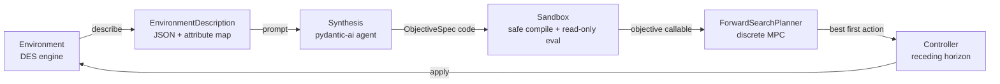

# LG-OMPC: Language-Guided Objective Model Predictive Control

LG-OMPC is an early-stage research project exploring how large language models can dynamically synthesize objective functions for world-model-based planning.

The core idea is to separate **task understanding** from **action optimization**:

* the LLM interprets the environment, agents, available actions, and desired final state;
* the LLM generates a structured objective function and relevant constraints;
* a world model predicts future states under candidate actions;
* an MPC planner optimizes over a receding horizon and executes the first action.

In short:

> The LLM defines what matters.
> The world model predicts what happens.
> MPC decides what to do next.

## Motivation

World models are useful because they can predict how an environment evolves. However, they do not automatically know what should be optimized in different situations.

In many tasks, the challenge is not only modeling the dynamics, but also defining the right objective. A fixed reward or cost function may work in one environment but fail in another. LG-OMPC investigates whether language models can generate task-specific objectives from high-level descriptions, avoiding the need to manually redesign reward functions for every new setting.

## Goals

* Build a simple world-model environment.
* Define a formal objective-function grammar.
* Use an LLM to generate structured MPC objectives.
* Validate the generated objectives before optimization.
* Compare against fixed hand-designed objectives.
* Study how well the method generalizes across different environments and tasks.

## Status & Examples

This project is at the MVP stage. A working end-to-end pipeline exists:
serialize a discrete-event environment, have a language model synthesize an
objective function, and run a receding-horizon discrete controller that plans
and acts. 

Our core capabilities are showcased in two rich interactive notebooks:

1. **Hydration (`examples/hydration/walkthrough.ipynb`)**: A 1D sandbox showing the basic separation of affordance vs. objective.
2. **Sample-Return Rover (`examples/rover/walkthrough.ipynb`)**: A 2D grid world showcasing multi-objective trade-offs. The LLM writes an objective balancing scientific discovery against a strict battery budget, resulting in a planner that exhibits "graceful degradation" (collecting fewer samples automatically as battery shrinks).

## Architecture & Opportunities

The MVP is a small, decoupled package. Each concern is an independent module so
any piece (model, planner, sandbox) can be swapped without touching the others.



| Module | Responsibility |
|---|---|
| `entities`, `actions`, `relations` | Base classes/protocols users subclass to model a world. Actions carry preconditions (affordance), not desirability. |
| `environment` | The true discrete-event system: enumerates applicable actions, applies them, and clones itself for branch-isolated search. |
| `serialization` | Turns a live environment into the LLM-facing description, including an `attribute_map` of exact readable paths. |
| `synthesis` | A pydantic-ai agent that returns an `ObjectiveSpec` (straight-Python objective code, terms, weights). |
| `sandbox` | Compiles generated code in a restricted namespace and evaluates it over a read-only, deep-copied snapshot; failures score `-inf`. |
| `planner` | Discrete MPC by finite-horizon forward search. |
| `controller` | The receding-horizon loop: synthesize once, plan, commit one action, repeat. |

Affordance (*can* an action run?) lives in the environment's action
preconditions. Desirability (*should* it run?) lives entirely in the
LLM-synthesized objective. Keeping these apart is the core design principle.

## Future Direction: Learned World Models (Neural Networks)

Currently, the "world model" in LG-OMPC is a hard-coded Discrete Event Simulation (DES). But the architecture is fully decoupled—meaning the `Environment` acting as the predictor is hot-swappable. 

If we replace the symbolic simulator with a **Learned World Model** (e.g., a neural network encoding transition dynamics like Dreamer's RSSM, a diffusion model, or a continuous state-space model), massive opportunities unlock:

1. **Differentiable MPC:** Instead of exhaustive forward tree-search, the LLM could synthesize the objective function in PyTorch or JAX. We could then use gradient-based trajectory optimization (like Model Predictive Path Integral control) by backpropagating the LLM's reward signal directly through the neural world model.
2. **Vision/Continuous Spaces:** The learned world model could predict future pixel frames or latent vectors. The LLM (or a VLM) could evaluate those future latent states to provide the reward signal, removing the need for manual state engineering.
3. **Infinite Affordances:** A neural world model doesn't need rigidly coded `available_actions()`. It can learn the physics of the world, meaning the planner can experiment with continuous action spaces knowing the world model will accurately enforce "virtual" affordances (e.g., you can't walk through a wall because the network predicts a collision).

## Quickstart

```bash
uv sync                      # install deps (pydantic-ai)
cp .env.example .env         # add your model API key
uv run python examples/hydration/run.py
```

Run the test suite (no API key required — it uses a stub model):

```bash
uv run pytest
```

## Repository Structure

```text
lg-ompc/
    ├── LICENSE
    ├── README.md
    ├── pyproject.toml
    ├── .env.example
    ├── docs/
    │   └── environment_definition.md
    ├── examples/
    │   └── hydration/
    │       ├── world.py
    │       └── run.py
    ├── src/
    │   └── lg_ompc/
    │       ├── __init__.py
    │       ├── entities.py
    │       ├── actions.py
    │       ├── relations.py
    │       ├── environment.py
    │       ├── serialization.py
    │       ├── sandbox.py
    │       ├── synthesis.py
    │       ├── planner.py
    │       └── controller.py
    └── tests/
```

## License

To be decided.
