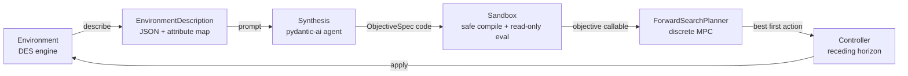

# LG-OMPC: Language-Guided Objective Model Predictive Control

LG-OMPC is an early-stage research project exploring how large language models can dynamically synthesize objective functions for world-model-based planning.

The core idea is to separate **task understanding** from **action optimization**:

* the LLM interprets the environment, agents, available actions, and desired final state;
* the LLM generates a structured objective function and relevant constraints;
* a world model predicts future states under candidate actions;
* an MPC planner optimizes over a receding horizon and executes the first action.

In short:

> The LLM defines what matters.
> The world model predicts what happens.
> MPC decides what to do next.

## Motivation

World models are useful because they can predict how an environment evolves. However, they do not automatically know what should be optimized in different situations.

In many tasks, the challenge is not only modeling the dynamics, but also defining the right objective. A fixed reward or cost function may work in one environment but fail in another. LG-OMPC investigates whether language models can generate task-specific objectives from high-level descriptions, avoiding the need to manually redesign reward functions for every new setting.

## Goals

* Build a simple world-model environment.
* Define a formal objective-function grammar.
* Use an LLM to generate structured MPC objectives.
* Validate the generated objectives before optimization.
* Compare against fixed hand-designed objectives.
* Study how well the method generalizes across different environments and tasks.

## Status

This project is at the MVP stage. A working end-to-end pipeline exists:
serialize a discrete-event environment, have a language model synthesize an
objective function, and run a receding-horizon discrete controller that plans
and acts. See the hydration example under `examples/`.

## Architecture

The MVP is a small, decoupled package. Each concern is an independent module so
any piece (model, planner, sandbox) can be swapped without touching the others.



| Module | Responsibility |
|---|---|
| `entities`, `actions`, `relations` | Base classes/protocols users subclass to model a world. Actions carry preconditions (affordance), not desirability. |
| `environment` | The true discrete-event system: enumerates applicable actions, applies them, and clones itself for branch-isolated search. |
| `serialization` | Turns a live environment into the LLM-facing description, including an `attribute_map` of exact readable paths. |
| `synthesis` | A pydantic-ai agent that returns an `ObjectiveSpec` (straight-Python objective code, terms, weights). |
| `sandbox` | Compiles generated code in a restricted namespace and evaluates it over a read-only, deep-copied snapshot; failures score `-inf`. |
| `planner` | Discrete MPC by finite-horizon forward search. |
| `controller` | The receding-horizon loop: synthesize once, plan, commit one action, repeat. |

Affordance (*can* an action run?) lives in the environment's action
preconditions. Desirability (*should* it run?) lives entirely in the
LLM-synthesized objective. Keeping these apart is the core design principle.

## Quickstart

```bash
uv sync                      # install deps (pydantic-ai)
cp .env.example .env         # add your model API key
uv run python examples/hydration/run.py
```

Run the test suite (no API key required — it uses a stub model):

```bash
uv run pytest
```

## Repository Structure

```text
lg-ompc/
    ├── LICENSE
    ├── README.md
    ├── pyproject.toml
    ├── .env.example
    ├── docs/
    │   └── environment_definition.md
    ├── examples/
    │   └── hydration/
    │       ├── world.py
    │       └── run.py
    ├── src/
    │   └── lg_ompc/
    │       ├── __init__.py
    │       ├── entities.py
    │       ├── actions.py
    │       ├── relations.py
    │       ├── environment.py
    │       ├── serialization.py
    │       ├── sandbox.py
    │       ├── synthesis.py
    │       ├── planner.py
    │       └── controller.py
    └── tests/
```

## License

To be decided.
